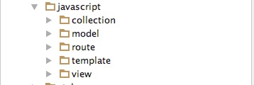
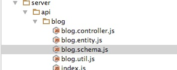
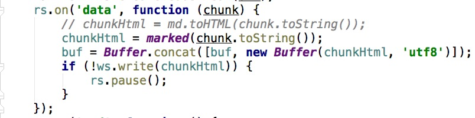
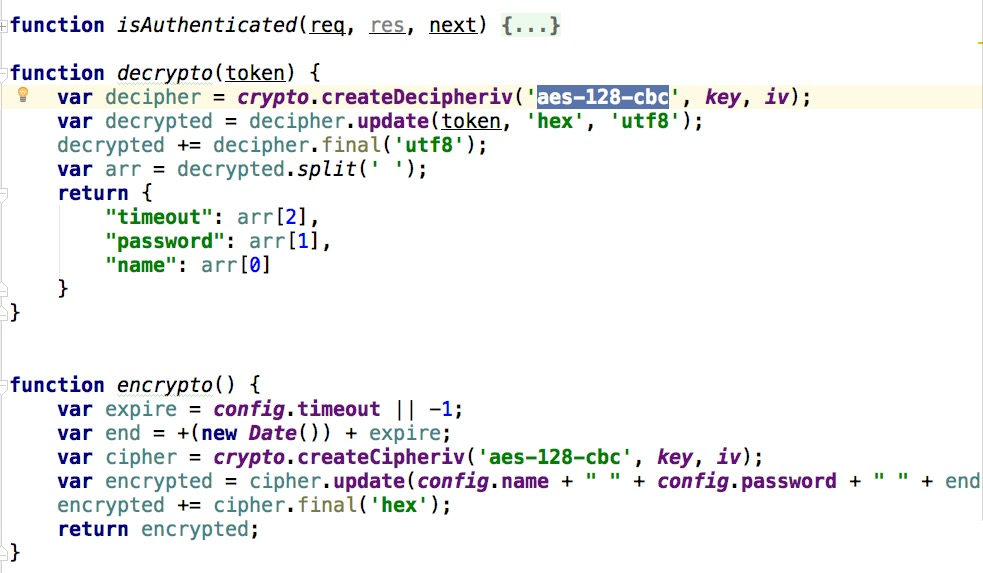
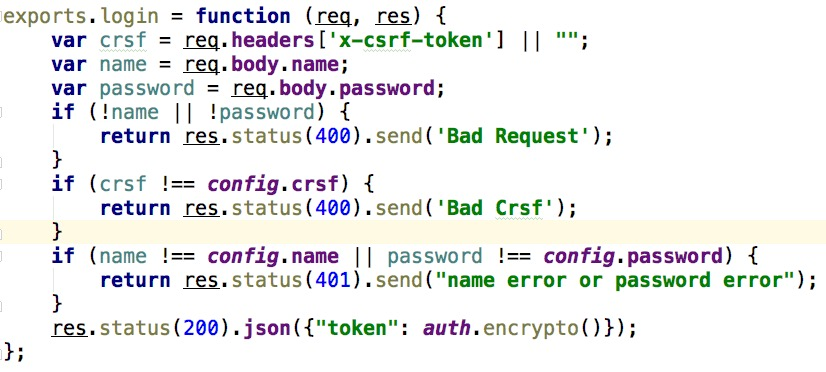
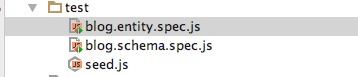
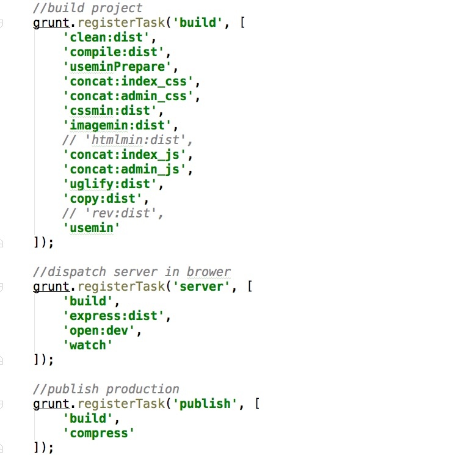
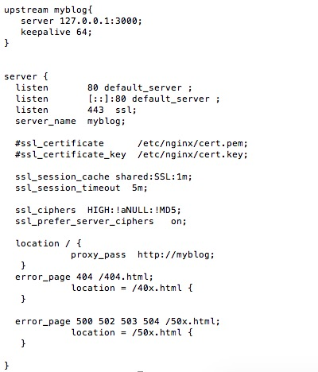

# myblog 
博客站点地址：[http://www.snayan.com](http://www.snayan.com)。项目地址：[https://github.com/snayan/myblog](https://github.com/snayan/myblog)

本项目用到的主要技术栈:[backbone](http://backbonejs.org/)+[sass](http://sass-lang.com/guide)＋[node](https://nodejs.org/en/)+[mocha](http://mochajs.org/)+[chai](http://chaijs.com/)+[grunt](http://www.gruntjs.net/)。

## coding
* backbone 
  
  系统前端交互逻辑与视图渲染，运用collection,model,view,router,等backbone的特性，快速开发SPA应用。视图主要是用ejs模版引擎加上json数据进行渲染。js文件加载采用AMD模式异步加载，包依赖管理使用bower工具。
  
  

* sass
  
  系统样式渲染用sass编写scss，之后用grunt构件工具将scss编译成css文件
  
  

  
* node

  系统运用RESTFUL API架构风格。服务端用express框架提供数据接口，配合backbone中model和collection的交互操作，主要是获取，更新，保存，删除等。抛开了mogodb存储，结合node的file模块使用文本文件存储,自己需要实现与backbone对应的一些model,例如，blog对象,以及blogSchema对象等，blogSchema是操作blog的封装对象，主要封装了CURD操作，每一类操作都有对应的asynchronous和synchronous函数。本来是刚开始都用monogodb和mongoose做好了，后来想着自己试着实现一个ORM对象，可以多学习一点，多折腾一点。
  
  
  
  文章发表是我只需要写markdown文件，上传即可。采用github上的marked将markdown文件转成html，用hignlight.js着色。
  
  
  
 
  管理员认证过程没有使用现有的passport模块，而是自己用node的crypto模块，用aes-128-cbc进行加密和解密。将用户名和密码以及有效时间用空格加在一起加密，设置到cookie中。后续需要认证的操作都在router中加上认证校验即可。
  
  
  
  由于管理员认证是通过cookie和crypto实现的，那么就很容易被CRSF攻击。这方面，在管理员页面中动态生成一个token,传递到前端，后续前端的每次有权限校验的操作都需要把这个token放在header中传递，服务端获取这个token，加以验证。
  
  

* mocha+chai
  
  测试框架使用mocha,断言库使用chai。
  
  
 
* grunt 
 
   最后就是项目构建工具了。grunt构建工具负责项目的ejs预编译，sass的编译，静态资源的concat,min,uglify,copy,rev等，以及express的启动和热加载，以及项目的打包和发布。grunt官网中都提供了非常丰富的插件，以及详细介绍说明，详见官网查看吧。本次项目用的grunt文件，略图如下，
   
   
 
## publish 

好了，通过前面的编码，系统已经初步完成了。现在需要部署发布到线上了。本来很少的工资，害的忍心到阿里云购买了最低配置的服务器，1G单核的，宽带1mbps,也不需要什么多核去做负载均衡了，也没有买CDN加速缓存了。自己的站点，自己都很少去逛，估计别人也不会逗留多长时间😄。听说，现在的对码农的要求都是熟悉Linux环境，由于以前是做.net的，玩的都是window系统，所以，这次，买的服务器是centos最新版的7.2 64位。首先安装了nginx，用作反向代理，配置如下图，接着安装了node,又安装了pm2,又安装了unzip。最后终于搞完了。什么都自己动手做一下，收获还是很多的。

## License

[BSD license](http://opensource.org/licenses/bsd-license.php)
  

